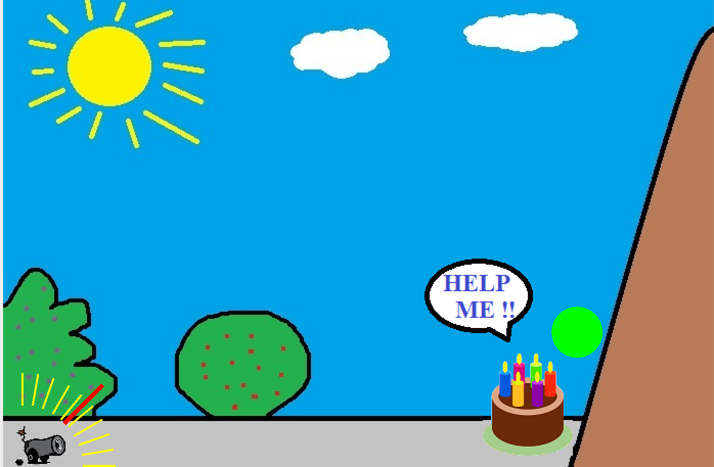

# Save The Cake


Get ready for a thrilling challenge with Save The Cake! Your mission is to protect a delicious cake from a rolling mud ball using your quick reflexes and sharp shooting skills. Can you prevent the mud ball from smashing the cake at the bottom of the hill? It's a test of speed and accuracy that will keep you on the edge of your seat!

## Features
- **Gameplay:** Stop the mud ball from reaching the cake with your shooting skills.
- **Graphics:** Enjoy simple yet captivating visuals.
- **Sound Effects:** Immerse yourself with laser and bazooka sound effects for an engaging experience.

## Getting Started
### Prerequisites
- Java Runtime Environment (JRE) 8 or higher
### Installation
1. Clone the repository:
    ```sh
    git clone https://github.com/seddonnguyen/SaveTheCake.git
    ```
2. Navigate to the project directory:
    ```sh
    cd SaveTheCake
    ```
3. Run the game:
    ```sh
    java -jar SaveTheCake.jar
    ```

## Usage
Get ready to dive into the game! Grab your keyboard and take aim as you shoot at the rolling mud ball. Your mission: stop the ball in its tracks before it demolishes the cake.

## License
This project is licensed under the MIT License, making it free to use and modify. See the [LICENSE](https://github.com/seddonnguyen/SaveTheCake/blob/master/LICENSE) file for details.

## Contact
Your engagement is important to me. Please feel free to reach out with any questions or feedback by opening an issue on the repository. Your input is highly valued.

Enjoy saving the cake!
